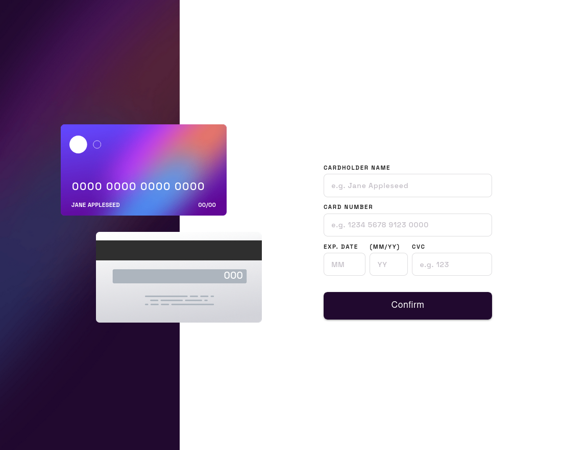
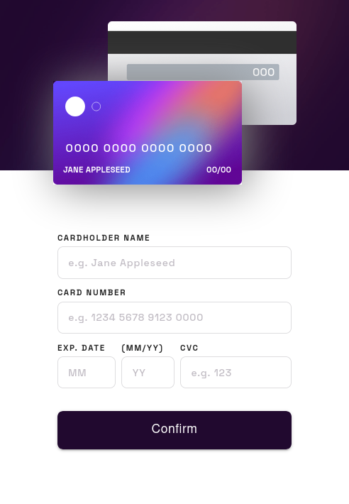

# Frontend Mentor - Interactive card details form solution

This is a solution to the [Interactive card details form challenge on Frontend Mentor](https://www.frontendmentor.io/challenges/interactive-card-details-form-XpS8cKZDWw). Frontend Mentor challenges help you improve your coding skills by building realistic projects. 

## Table of contents

- [Overview](#overview)
  - [The challenge](#the-challenge)
  - [Screenshot](#screenshot)
  - [Links](#links)
- [My process](#my-process)
  - [Built with](#built-with)
  - [What I learned](#what-i-learned)
  - [Continued development](#continued-development)
- [Author](#author)

## Overview

### The challenge

Users should be able to:

- Fill in the form and see the card details update in real-time
- Receive error messages when the form is submitted if:
  - Any input field is empty
  - The card number, expiry date, or CVC fields are in the wrong format
- View the optimal layout depending on their device's screen size
- See hover, active, and focus states for interactive elements on the page

### Screenshot

### Links

- Solution URL: [Add solution URL here](https://your-solution-url.com)
- GitHub Repo: [https://github.com/hectorgarcia07/FEM-Interactive-Card-Details](https://hectorgarcia07.github.io/FEM-Interactive-Card-Details/)

## My process

### Built with

- CSS custom properties
- Flexbox
- CSS Grid
- Mobile-first workflow
- [React](https://reactjs.org/) - JS library
- [Yup](https://github.com/jquense/yup) - For form validation
- [Styled Components](https://styled-components.com/) - For styles
- [Formik](https://styled-components.com/) - Used to easily build forms
- [MaterialUI](https://mui.com/) - Used to easily build components

### What I learned

I leared quite a lot in the project. One of the issues that I had was how to create a form that can
keep track of validation. This is where the iconic duo comes into play, Formik and Yup. With Formik,
I could easily build a form and not worry about its own interal state. Formik pairs easily with Yup
since I could easily create a form schema validator and pass that to Formik and validation is taken care of!

The only issue with Formik is that passing it's current state to a parent component was difficult. I solved this
by wraping the Form component with React context to allow its form state to be shared to it's parent.

I decided to learn MaterialUI to rapidly build components and styled it accordingly. Only issue was customizing and styling the form, but after reading the docs, it wasn't that bad.

### Continued development

I plan on expanding this by detecting the company of the card based on the card number (ex: AMX, VISA, MASTER CARD, etc...) and showing the logo accordingly as well as it's CVV number. I also plan to refactor the components
a bit and add more CSS transition.

## Author

- GitHub - [Hector Garcia](https://github.com/hectorgarcia07)
- Frontend Mentor - [@hectorgarcia07](https://www.frontendmentor.io/profile/hectorgarcia07)
- Twitter - [@jdbjfl](https://www.twitter.com/jdbjfl)